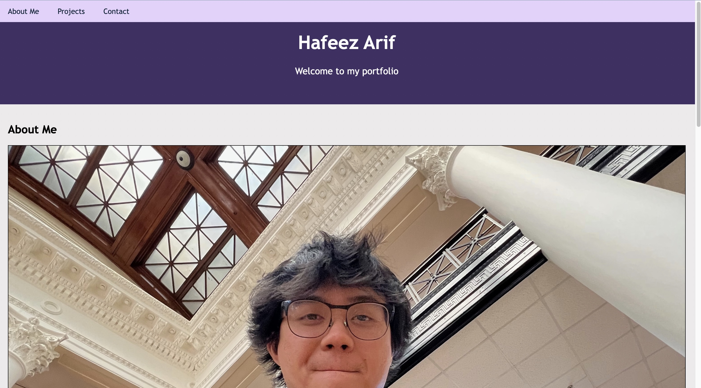

# Hafeez's Portfolio

## Description

This project was built around the essentials of creating and having a portfolio. Not only does it showcase other personal projects one has made but it only further emphasizes the importance of being able to 'sell yourself' to other people. This in turn results in having a future full of connections and employers. In addition, it further provides a platform in which I can continue to compare the skills I slowly gain throughout learning. 

## Usage

Link to live website:

https://hafeezarif.github.io/Hafeez-s-Portfolio/ 